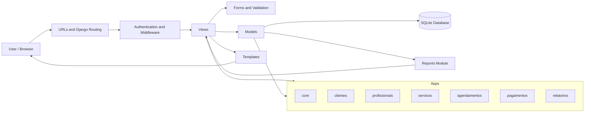
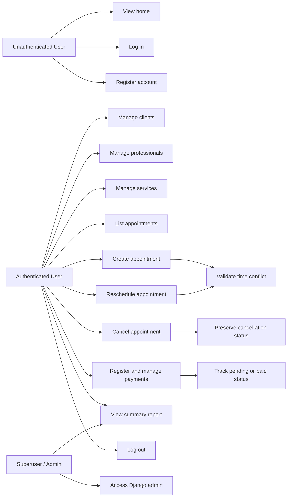

# VANT Clinic

<p align="left">
	
	
	
</p>

Web platform for aesthetic clinic operations, focused on core records, appointment scheduling, payments, and operational visibility.


## Overview

VANT was built with Django using a modular app-based structure. The system centralizes clinic operations in a single workflow and reduces schedule conflicts through active time-slot validation per professional.

### Main modules

- `core`: home page, authentication, and base layout.
- `clientes`: client create, update, list, and delete flows.
- `profissionais`: professional records and maintenance.
- `servicos`: aesthetic service catalog, duration, and pricing.
- `agendamentos`: appointment creation, editing, and cancellation.
- `pagamentos`: payment control linked to appointments.
- `relatorios`: operational and financial summary.

### Modulos principais

- `core`: tela inicial, autenticacao e layout base.
- `clientes`: cadastro, edicao, listagem e exclusao de clientes.
- `profissionais`: cadastro e manutencao de profissionais.
- `servicos`: catalogo de servicos esteticos, duracao e preco.
- `agendamentos`: criacao, edicao e cancelamento de atendimentos.
- `pagamentos`: controle de pagamentos vinculados aos agendamentos.
- `relatorios`: resumo operacional e financeiro.


## Features

- Client, professional, and service management.
- Authentication with `register`, `login`, and `logout`.
- Protected business routes for authenticated users.
- Appointment creation and update linking client, professional, service, date, and time.
- Conflict prevention for two active appointments at the same time for the same professional.
- Appointment cancellation with time-slot release.
- Payment records with amount, status, payment date, and payment method.
- Summary report with totals for appointments, cancellations, services, payments, and total paid amount.


## Architecture

The project follows MVC concepts adapted to Django's MVT structure:

- `Model`: represents domain data and database rules.
- `View`: processes requests, applies business rules, and returns responses.
- `Template`: renders the web interface.

This structure fits the current scope well and keeps the project simple to maintain and present academically.

## Diagrams

<details>
<summary>Architecture Diagram</summary>



</details>

<details>
<summary>Use Case Diagram</summary>



</details>

## Documentation

- `docs/requisitos-vant.md`: system requirements and functional scope.
- `docs/relatorio-validacao-manual.md`: manual backend validation checklist.
- `docs/planejamento-arquitetura-software.md`: consolidated software architecture planning document.

## Documentacao

- `docs/requisitos-vant.md`: requisitos e escopo funcional do sistema.
- `docs/relatorio-validacao-manual.md`: roteiro de validacao manual do backend.
- `docs/planejamento-arquitetura-software.md`: planejamento arquitetural consolidado do projeto.


## Technologies

- Python
- Django
- SQLite
- Django Templates
- Custom CSS and JavaScript
- Git and GitHub


## Quick Start

Run the commands below from the project root.

### 1. Activate the virtual environment

```powershell
.\.venv\Scripts\Activate.ps1
```

### 2. Install dependencies

```powershell
python -m pip install -r requirements.txt
```

### 3. Apply migrations

```powershell
python manage.py makemigrations
python manage.py migrate
```

### 4. Create an admin user

```powershell
python manage.py createsuperuser
```

### 5. Run the server

```powershell
python manage.py runserver
```

Application: `http://127.0.0.1:8000/`

## Authentication Flow

- Register: `/auth/register/`
- Login: `/auth/login/`
- Logout: `/auth/logout/`

Without authentication, module routes automatically redirect users to the login page.

## Main Routes

- `/`
- `/admin/`
- `/clientes/`
- `/profissionais/`
- `/servicos/`
- `/agendamentos/`
- `/pagamentos/`
- `/relatorios/resumo/`

## Core Business Rule

Inside the scheduling module, the system validates active time conflicts per professional.

- If there is already an active appointment for the same professional at the same time, the new appointment is blocked.
- If the previous appointment is cancelled, the time slot becomes available again.

## Quick Validation

General check:

```powershell
python manage.py check
```

Quick route validation:

```powershell
python manage.py shell -c "from django.test import Client; c=Client(); urls=['/','/clientes/','/profissionais/','/servicos/','/agendamentos/','/pagamentos/','/relatorios/resumo/']; print({u:c.get(u, HTTP_HOST='localhost').status_code for u in urls})"
```

## Project Structure

```text
config/           # global settings and URLs
core/             # home, authentication, and base layout
clientes/         # client CRUD
profissionais/    # professional CRUD
servicos/         # service CRUD
agendamentos/     # scheduling, editing, and cancellation
pagamentos/       # payment CRUD
relatorios/       # operational and financial summary
docs/             # requirements, validation, and planning
```

## Environment Notes

The project is ready for local development. For production, it is recommended to use:

- a managed database such as PostgreSQL;
- proper `ALLOWED_HOSTS` configuration;
- `SECRET_KEY` from environment variables;
- a dedicated WSGI or ASGI server.
